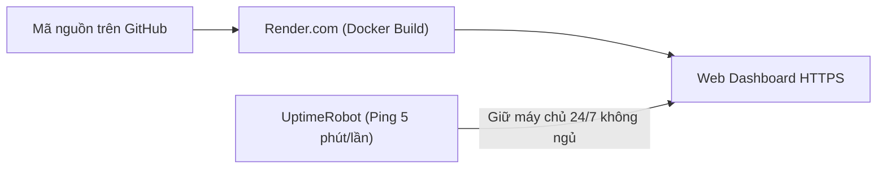

# 🌐 HƯỚNG DẪN DEPLOY LÊN WEB THẬT MIỄN PHÍ 100% (DEPLOYMENT GUIDE)

Tài liệu này hướng dẫn chi tiết từng bước để đưa ứng dụng **Facebook Fanpage Insight & Publisher Stat** lên Internet hoàn toàn miễn phí, có tên miền SSL (`https://`) và hoạt động ổn định 24/7.

---

## 🌟 PHƯƠNG ÁN 1: DEPLOY MIỄN PHÍ LÊN RENDER.COM (KHUYÊN DÙNG)

[Render.com](https://render.com) là nền tảng điện toán đám mây hiện đại hỗ trợ chạy Docker, tự động build từ GitHub và cung cấp tên miền HTTPS miễn phí.



### Bước 1: Đẩy toàn bộ code mới nhất lên GitHub
Đảm bảo bạn đã commit và push tất cả các file (kèm `Dockerfile`, `render.yaml`) lên kho chứa GitHub cá nhân.

### Bước 2: Đăng ký & Kết nối tài khoản Render
1. Mở trang: 👉 **[https://render.com/](https://render.com/)**.
2. Bấm nút **GET STARTED FOR FREE** -> Chọn **GitHub** để đăng nhập trực tiếp bằng tài khoản GitHub của bạn.

### Bước 3: Tạo Dịch Vụ Web Mới (New Web Service)
1. Trên màn hình điều khiển của Render, bấm nút màu tím: **New +** (góc trên bên phải) -> Chọn **Web Service**.
2. Chọn dòng **Build and deploy from a Git repository** -> Bấm **Next**.
3. Danh sách kho lưu trữ GitHub của bạn sẽ hiện ra:
   - Tìm kho chứa: `phamcongdanh98/CrawDataPostFB` (hoặc tên repo của bạn) -> Bấm nút **Connect**.
4. Cấu hình thông tin ứng dụng:
   - **Name:** Điền tên bất kỳ bạn thích (Ví dụ: `thongke-fanpage` hoặc `fb-stat`).
   - **Region:** Chọn **Singapore (Southeast Asia)** để có tốc độ truy cập về Việt Nam nhanh nhất.
   - **Branch:** Chọn `main`.
   - **Runtime:** Hệ thống sẽ **tự động chọn `Docker`** (vì dự án đã có sẵn file `Dockerfile`).
   - **Instance Type:** Chọn gói **Free ($0/month)**.

### Bước 4: Điền Biến Môi Trường (Environment Variables)
Cuộn xuống phần **Environment Variables** -> Bấm **Add Environment Variable** để thêm các biến cần thiết:

| Tên Biến (Key) | Giá Trị (Value) | Giải Thích |
|---|---|---|
| `NODE_ENV` | `production` | Chạy chế độ tối ưu bộ nhớ |
| `PORT` | `3000` | Cổng máy chủ |
| `PAGE_ID` | `778169405386344` | ID Fanpage của bạn |
| `FB_PAGE_ACCESS_TOKEN` | *Chuỗi token Graph API của bạn* | Token lấy bài viết |
| `ADMIN_EMAIL` | `admin@gmail.com` | Email quản trị viên đăng nhập |
| `ADMIN_PASSWORD` | `Admin@123456` | Mật khẩu quản trị viên |
| `SMTP_USER` | *email_cua_ban@gmail.com* | (Tùy chọn) Gmail gửi mã OTP |
| `SMTP_PASS` | *mat_khau_ung_dung_16_chu* | (Tùy chọn) App Password của Gmail |

### Bước 5: Bấm Deploy
- Nhấn nút màu tím: **Create Web Service**.
- Render sẽ tự động build image Docker (tải Chromium và thiết lập môi trường) trong khoảng 3 - 5 phút.
- Khi hoàn tất, bạn sẽ thấy trạng thái báo xanh **Live** kèm đường dẫn web thật của bạn, ví dụ:
  👉 `https://thongke-fanpage.onrender.com`

---

## ⚡ BÍ QUYẾT: GIỮ MÁY CHỦ RENDER LUÔN HOẠT ĐỘNG 24/7 (KHÔNG BỊ NGỦ)

> [!NOTE]
> Gói Free của Render sẽ tự động đưa máy chủ vào trạng thái "ngủ" (Sleep) nếu sau 15 phút không có ai truy cập. Khi máy chủ ngủ, vòng lặp tự động (Auto-Sync) sẽ tạm dừng.
> Để máy chủ **thức 24/7/365 hoàn toàn miễn phí**, chúng ta sử dụng công cụ **UptimeRobot**:

1. Truy cập: 👉 **[https://uptimerobot.com/](https://uptimerobot.com/)** -> Bấm **Sign Up Free**.
2. Đăng nhập vào Dashboard của UptimeRobot -> Bấm **+ Add New Monitor**.
3. Cài đặt thông số như sau:
   - **Monitor Type:** Chọn `HTTP(s)`.
   - **Friendly Name:** Điền `Keep Alive FB Stat`.
   - **URL (or IP):** Dán link Render của bạn kèm đuôi `/api/health`.
     - *Ví dụ:* `https://thongke-fanpage.onrender.com/api/health`
   - **Monitoring Interval:** Chọn `Every 5 minutes` (Cứ mỗi 5 phút UptimeRobot sẽ ping một tín hiệu nhẹ để giữ Render luôn thức).
4. Bấm **Create Monitor** -> **Xong!**
👉 Từ nay ứng dụng của bạn sẽ chạy 24/7 liên tục, chu trình tự động quét và gửi báo cáo Telegram Bot hoạt động đều đặn mà không tốn 1 đồng chi phí nào!

---

## 👑 PHƯƠNG ÁN 2: DEPLOY LÊN VPS ORACLE CLOUD (ALWAYS FREE)

Nếu bạn có thẻ thanh toán quốc tế và muốn có 1 máy chủ VPS riêng biệt cực mạnh (RAM lên tới 24GB, ổ cứng SSD NVMe 50GB-200GB vĩnh viễn):

1. Đăng ký tài khoản tại: 👉 **[https://cloud.oracle.com/](https://cloud.oracle.com/)**.
2. Tạo 1 máy ảo Ubuntu (Compute Instance) thuộc nhóm **Always Free Eligible**.
3. Mở Terminal SSH vào máy chủ VPS và chạy 3 lệnh sau:
   ```bash
   # 1. Cài đặt Docker
   curl -fsSL https://get.docker.com -o get-docker.sh && sh get-docker.sh

   # 2. Clone mã nguồn từ GitHub
   git clone https://github.com/phamcongdanh98/CrawDataPostFB.git
   cd CrawDataPostFB

   # 3. Tạo file cấu hình và chạy ngầm bằng Docker
   cp .env.example .env # Điền thông tin vào .env
   docker build -t fb-stat .
   docker run -d --name fb-stat-app -p 3000:3000 --restart always -v $(pwd)/data:/app/data fb-stat
   ```
👉 Ứng dụng sẽ chạy vĩnh viễn trên IP máy chủ VPS của bạn!
