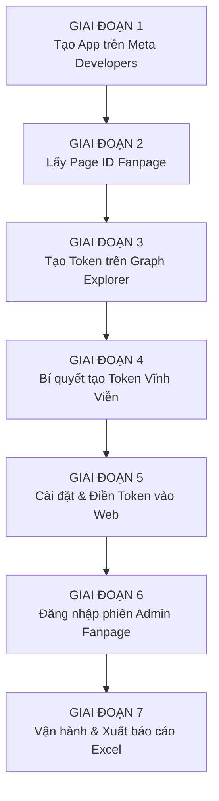

# 📊 HỆ THỐNG THỐNG KÊ BÀI VIẾT FANPAGE & NGƯỜI ĐĂNG (FACEBOOK FANPAGE PUBLISHER STAT)

Ứng dụng tự động hóa chuyên nghiệp kết hợp **Meta Graph API** chính thức và **Playwright Chromium**:
- 📈 **Tương tác chuẩn xác 100% từ Graph API**: Lấy trực tiếp Lượt thích / Cảm xúc (Likes/Reactions), Bình luận (Comments) và Lượt chia sẻ (Shares) từ máy chủ Meta.
- 👤 **Bóc tách danh tính người đăng (Publisher)**: Tự động phát hiện Quản trị viên/Biên tập viên nào đã đăng bài (*"Đăng bởi / Published by..."*) trong nội bộ Fanpage.
- 📊 **Dashboard Web trực quan**: 6 thẻ chỉ số KPI tự động tính toán đồng bộ theo bộ lọc, bảng dữ liệu phân trang, lọc theo Quản trị viên, tìm kiếm tức thì.
- 📑 **Xuất Excel (.xlsx) chuyên nghiệp**: Tạo báo cáo bảng tính chuẩn doanh nghiệp với 2 Sheet (Chi tiết bài viết & Bảng xếp hạng Admin), tự động tạo link Canonical mở trực tiếp bài viết.

---

## ⚡ BẠN ĐANG GẶP LỖI THIẾU LIKES / COMMENTS? SỬA NGAY TRONG 30 GIÂY!

> [!WARNING]
> **CHẨN ĐOÁN LỖI HIỆN TẠI:**
> Nếu bài viết của bạn lấy về được Lượt chia sẻ (Shares) nhưng **Lượt thích (Likes) và Bình luận (Comments) đều bằng 0**, nguyên nhân 100% là do Token của bạn đang **THIẾU QUYỀN `pages_read_user_content`**.
> 
> *Kiểm tra ngay:* Vào Dashboard [http://localhost:3000](http://localhost:3000) -> Bấm nút **⚙️ Cài đặt** -> Bấm **🔍 Kiểm tra quyền Token**. Bạn sẽ thấy dòng `pages_read_user_content` đang báo đỏ ❌.

### 3 Bước khắc phục ngay lập tức:
1. Mở trang: 👉 **[https://developers.facebook.com/tools/explorer/](https://developers.facebook.com/tools/explorer/)**.
2. Nhìn sang cột bên phải:
   * **Meta App:** Chọn đúng App của bạn (`Thong ke Fanpage`).
   * Bấm vào ô **Add a Permission** -> Gõ hoặc chọn: **`pages_read_user_content`**.
   * Bấm nút màu xanh **Generate Access Token** -> Tích chọn Fanpage -> Bấm **Tiếp tục** -> Bật hết quyền xanh -> **Xong**.
3. Tại ô **User or Page**: Bấm menu xổ xuống -> Chọn đúng tên Fanpage của bạn -> Copy chuỗi Token mới -> Mở [http://localhost:3000](http://localhost:3000) dán vào ô Token -> Bấm **Lưu cấu hình**.
👉 Sau đó bấm **Lấy bài viết mới** là toàn bộ Likes và Comments sẽ nhảy số chuẩn xác 100%!

---

# 📚 CẨM NANG HƯỚNG DẪN TỪNG BƯỚC CHO NGƯỜI MỚI (TỪ CON SỐ 0 ĐẾN KHI HOÀN TẤT)



---

## GIAI ĐOẠN 1: Tạo Tài Khoản Meta Developer & Khởi Tạo Ứng Dụng (App)

> **Lưu ý tiên quyết:** Bạn cần dùng tài khoản Facebook cá nhân đang trực tiếp nắm quyền **Quản trị viên (Admin)** hoặc **Biên tập viên** của Fanpage.

### Bước 1.1: Đăng nhập Cổng Meta for Developers
1. Mở trình duyệt (Chrome/Edge/Cốc Cốc) và truy cập: 👉 **[https://developers.facebook.com/](https://developers.facebook.com/)**.
2. Nhìn lên **góc trên cùng bên phải**:
   * Nếu thấy nút **Đăng nhập (Log In)**: Bấm vào và đăng nhập bằng tài khoản Facebook của bạn.
   * Nếu thấy nút **Bắt đầu (Get Started)**: Đây là tài khoản mới lần đầu truy cập:
     * Nhấn **Bắt đầu** -> Nhấn **Tiếp tục (Continue)** chấp nhận điều khoản.
     * Nhập số điện thoại -> Nhận mã OTP qua tin nhắn SMS -> Bấm **Xác minh số điện thoại**.
     * Ở bước "Bạn là ai? (What is your role?)", chọn **Nhà phát triển (Developer)** hoặc **Khác (Other)** -> Bấm **Hoàn tất đăng ký (Complete Registration)**.

---

### Bước 1.2: Bấm nút Tạo Ứng Dụng Mới (Create App)
1. Ở thanh menu trên cùng bên phải, bấm vào chữ: **Ứng dụng của tôi (My Apps)**.
2. Bạn sẽ thấy một nút bấm màu xanh dương nổi bật: **Tạo ứng dụng (Create App)** -> Hãy bấm vào nút này.

---

### Bước 1.3: Chọn Loại Ứng Dụng (Phân biệt 2 giao diện Meta)

Meta thường xuyên cập nhật giao diện, hãy xem màn hình của bạn thuộc trường hợp nào dưới đây:

#### 🔹 Trường hợp A: Giao diện Cổ điển (Classic - Thường gặp nhất)
1. **Màn hình 1 - Bạn muốn ứng dụng của mình làm gì?**:
   * Tích chọn dòng: **Khác (Other)** ở dưới cùng.
   * Bấm nút màu xanh **Tiếp (Next)** ở góc dưới bên phải.
2. **Màn hình 2 - Chọn loại ứng dụng (Select an app type)**:
   * Tích chọn dòng: **Doanh nghiệp (Business)** *(Loại này hỗ trợ toàn bộ quyền quản lý Page)*.
   * Bấm nút **Tiếp (Next)**.

#### 🔹 Trường hợp B: Giao diện Hiện đại (Use Cases 2024 - 2026)
1. Hệ thống sẽ hỏi: *"What do you want your app to do?"* hoặc đưa ra danh sách các trường hợp sử dụng (Use Cases).
2. Cuộn xuống dưới cùng -> Chọn ô **Other (Khác)** -> Bấm **Next**.
3. Chọn loại **Business (Doanh nghiệp)** -> Bấm **Next**.

---

### Bước 1.4: Điền Thông Tin Ứng Dụng
1. Một biểu mẫu gồm các ô nhập liệu sẽ hiện ra:
   * **Tên hiển thị ứng dụng (App Display Name):** Điền tên bất kỳ bạn thích.
     * ⚠️ *Lưu ý quan trọng:* **KHÔNG ĐƯỢC** chứa các từ khóa thương hiệu như `Facebook`, `Meta`, `FB`, `Instagram`.
     * Ví dụ hợp lệ: `Thong Ke Fanpage Noi Bo`, `Bao Cao Tuong Tac`, `Fanpage Analytic Tool`.
   * **Email liên hệ (App Contact Email):** Điền email bạn đang sử dụng.
   * **Tài khoản Business Account (Tùy chọn):** Có thể để trống hoặc chọn nếu bạn có Business Manager.
2. Bấm nút màu xanh: **Tạo ứng dụng (Create App)**.
3. **Bảo mật Facebook:** Một cửa sổ nhỏ sẽ hiện lên yêu cầu: *"Để bảo mật, vui lòng nhập lại mật khẩu của bạn"*.
   * Hãy nhập mật khẩu đăng nhập Facebook cá nhân của bạn -> Bấm **Gửi (Submit)**.
4. Màn hình Bảng điều khiển (Dashboard) của App xuất hiện. **Giai đoạn 1 đã xong!**

---

## GIAI ĐOẠN 2: Lấy Page ID Chính Xác Của Fanpage

Page ID là một chuỗi các chữ số đại diện duy nhất cho Trang Fanpage của bạn trên hệ thống Meta.

### Cách 1: Xem trực tiếp trên Fanpage (Khuyên dùng)
1. Mở trang Fanpage trên máy tính (Ví dụ: `https://www.facebook.com/namnhatrangdatvanguoi/`).
2. Bấm vào tab **Giới thiệu (About)** nằm ngay dưới ảnh bìa.
3. Ở menu cột bên trái của mục Giới thiệu, bấm vào **Tính minh bạch của Trang (Page Transparency)**.
4. Một hộp thoại hiện ra, bạn sẽ thấy ngay dòng:
   * **ID Trang (Page ID):** `778169405386344` *(dãy số tương ứng của bạn)*.
5. Sao chép (Copy) dãy số này ra Notepad.

### Cách 2: Xem nhanh qua Graph API Explorer (Không lo web giả mạo)
Khi bạn vào Graph API Explorer ở Giai đoạn 3, chọn tên Trang ở mục *User or Page* thì ID của Trang cũng sẽ tự động hiển thị bên cạnh!

---

## GIAI ĐOẠN 3: Tạo Access Token Đầy Đủ Quyền Trên Graph API Explorer

> [!IMPORTANT]
> Đây là giai đoạn quan trọng nhất quyết định bạn có lấy được Lượt thích và Bình luận hay không. Hãy làm chậm và chính xác từng thao tác!

### Bước 3.1: Mở công cụ Graph API Explorer
Truy cập vào đường link công cụ chính thức của Meta:
👉 **[https://developers.facebook.com/tools/explorer/](https://developers.facebook.com/tools/explorer/)**

Màn hình công cụ sẽ chia làm 2 khu vực chính như sau:

```text
+-----------------------------------------------------------------------------------+
|  Meta for Developers  |  Graph API Explorer                                       |
+-----------------------------------------------------------------------------------+
|  [GET] [ v26.0 ] [ me?fields=id,name                             ]  [ Nút GỬI ]   |
+------------------------------------------+----------------------------------------+
|                                          | CỘT CẤU HÌNH BÊN PHẢI:                 |
|                                          |                                        |
|  KHUNG KẾT QUẢ HIỂN THỊ DỮ LIỆU (JSON)   | 1. Ứng dụng Meta (Meta App):           |
|                                          |    [ Chọn App bạn vừa tạo ở GĐ 1  ▼ ]  |
|                                          |                                        |
|                                          | 2. Cơ chế (User or Page):              |
|                                          |    [ User Token                   ▼ ]  |
|                                          |                                        |
|                                          | 3. Mã truy cập (Access Token):         |
|                                          |    [ Chuỗi EAA...                 📋]  |
|                                          |                                        |
|                                          | 4. Quyền hạn (Permissions):            |
|                                          |    [ + Thêm quyền / Add Permission ▼ ] |
|                                          |                                        |
|                                          | 5. [ NÚT TẠO MÃ / GENERATE TOKEN ]     |
+------------------------------------------+----------------------------------------+
```

---

### Bước 3.2: Cấu hình App và Thêm 4 Quyền Bắt Buộc

1. Nhìn vào cột bên phải, mục **Ứng dụng Meta (Meta App)**:
   * Nhấp chuột vào menu thả xuống.
   * Chọn đúng tên ứng dụng bạn vừa tạo ở Giai đoạn 1 (Ví dụ: `Thong Ke Fanpage Noi Bo` hoặc `Thong ke Fanpage`).
2. Nhìn xuống mục **Quyền hạn (Permissions)**:
   * Bấm vào ô thả xuống **Thêm quyền (Add a Permission)** hoặc danh mục **Events Groups & Pages**.
   * Gõ tìm kiếm và chọn lần lượt **ĐỦ 4 QUYỀN SAU**:

| STT | Tên Quyền (Permission) | Tác Dụng Cụ Thể | Mức Độ Bắt Buộc |
|:---:|---|---|:---:|
| 1 | `pages_show_list` | Nhìn thấy danh sách các Fanpage bạn quản trị | 🟢 Bắt buộc |
| 2 | `pages_read_engagement` | Đọc danh sách bài viết, nội dung và lượt Share | 🟢 Bắt buộc |
| 3 | **`pages_read_user_content`** | **Đọc Lượt thích (Likes) và Bình luận (Comments)** | 🔴 **QUYẾT ĐỊNH (Thiếu quyền này là Like/Comment = 0)** |
| 4 | `pages_manage_posts` | Đọc toàn bộ bài đăng của Trang và bài chia sẻ | 🟢 Bắt buộc |

---

### Bước 3.3: Bấm nút Tạo Mã (Generate Access Token) & Cấp Quyền Facebook Popup

1. Bấm vào nút màu xanh dương: **Generate Access Token** (Tạo mã truy cập).
2. Một cửa sổ Facebook Popup nhỏ sẽ hiện ra giữa màn hình:
   * **Màn hình Popup 1:** Hiện thông báo *"Ứng dụng [Tên App] đang yêu cầu quyền truy cập..."* -> Bấm nút **Tiếp tục dưới tên [Tên Facebook của bạn]**.
   * **Màn hình Popup 2 (Chọn Trang):** Facebook hỏi *"Bạn muốn cho phép truy cập những Trang nào?"* -> **TÍCH CHỌN VÀO Ô VUÔNG TRƯỚC TÊN FANPAGE BẠN CẦN THỐNG KÊ** -> Bấm **Tiếp (Next)**.
   * **Màn hình Popup 3 (Quyền hạn):** Đảm bảo tất cả các công tắc lựa chọn đều gạt sang **BẬT (MÀU XANH)** -> Bấm nút **Xong (Done)**.
   * **Màn hình Popup 4:** Thông báo *"Bạn đã liên kết [Tên App] với Facebook"* -> Bấm **Đã hiểu (OK)**.
3. Cửa sổ popup sẽ tự động đóng lại.

---

### Bước 3.4: CHUYỂN TỪ USER TOKEN SANG PAGE TOKEN (BƯỚC QUAN TRỌNG NHẤT!)

> [!CAUTION]
> Sau khi popup đóng lại, mã trong ô Access Token vẫn đang là **User Token (Mã người dùng)**! Nếu dùng mã này, bạn sẽ gặp lỗi không đọc được bài viết hoặc tương tác. Bạn **BẮT BUỘC** phải đổi sang **Page Access Token**:

1. Nhìn vào cột bên phải, tìm ô: **Cơ chế người dùng hoặc Trang (User or Page)**.
2. Bấm vào menu thả xuống của ô này.
3. Cuộn xuống phần **Page Tokens (Mã truy cập trang)**:
   * Bấm chuột chọn đúng tên Fanpage của bạn (Ví dụ: `Nam Nha Trang - Đất và Người`).
4. ⚡ **Hiện tượng:** Ô **Access Token** bên cạnh sẽ tự động đổi sang một chuỗi mã mới bắt đầu bằng `EAA...`. Đây chính là **Page Access Token** chuẩn của Fanpage!

---

### Bước 3.5: Kiểm Tra Trực Tiếp Kết Quả Ngay Trên Graph Explorer

Để chắc chắn 100% Token của bạn đã có quyền đọc Likes và Comments:
1. Nhìn lên thanh nhập URL ở góc trên bên trái (nơi có chữ `GET` và phiên bản `v26.0`).
2. Xóa nội dung cũ đi và dán chính xác dòng lệnh sau:
   ```text
   me?fields=id,name,posts{id,shares,reactions.summary(total_count),comments.summary(total_count)}
   ```
3. Bấm nút **Gửi (Submit)** màu xanh dương bên cạnh.
4. Nhìn xuống khung kết quả JSON bên dưới:
   * Nếu thấy kết quả hiển thị dạng:
     ```json
     {
       "id": "778169405386344",
       "name": "Nam Nha Trang - Đất và Người",
       "posts": {
         "data": [
           {
             "id": "778169405386344_...",
             "shares": { "count": 10 },
             "reactions": { "summary": { "total_count": 125 } },
             "comments": { "summary": { "total_count": 18 } }
           }
         ]
       }
     }
     ```
   * 👉 **CHÚC MỪNG!** Bạn đã lấy thành công Page Access Token đầy đủ mọi quyền hạn! Hãy bấm biểu tượng **Sao chép (Copy)** ở góc ô Access Token.

---

## GIAI ĐOẠN 4: Bí Quyết Tạo Token Vĩnh Viễn (Never Expiring Page Token)

> Token lấy ở Giai đoạn 3 mặc định là token ngắn hạn (thường hết hạn sau 1 - 2 giờ). Để **không bao giờ phải lo lấy lại token**, hãy làm theo bí quyết sau:

### Cách lấy Page Token Vĩnh Viễn:
1. Trong màn hình Graph API Explorer, nhìn bên cạnh ô **Access Token**, bấm vào **biểu tượng dấu chấm than tròn `(i)`**.
2. Một bảng popover hiện ra -> Bấm nút **Mở trong Công cụ gỡ lỗi mã truy cập (Open in Access Token Tool)**.
3. Trình duyệt mở sang trang Access Token Debugger (`https://developers.facebook.com/tools/debug/accesstoken/`).
4. Cuộn xuống cuối trang -> Bấm nút **Mở rộng mã truy cập (Extend Access Token)**.
5. Nhập mật khẩu Facebook nếu được hỏi -> Bạn nhận được một chuỗi **Long-lived Token (60 ngày)**.
6. Sao chép chuỗi mã này, quay lại trang [Graph API Explorer](https://developers.facebook.com/tools/explorer/).
7. Dán chuỗi mã vừa copy vào ô **Access Token**.
8. Trên thanh URL GET, nhập:
   ```text
   me/accounts?fields=name,id,access_token
   ```
9. Bấm **Gửi (Submit)**.
10. Trong kết quả JSON trả về, tìm đến tên Fanpage của bạn -> Sao chép chuỗi trong trường `"access_token"`.
11. Đem chuỗi này vào trang Debugger kiểm tra: Dòng **Expires** sẽ hiển thị chữ **`Never` (Vĩnh viễn)**!

---

## GIAI ĐOẠN 5: Cấu Hình Token Vào Hệ Thống

Bạn có thể cấu hình bằng 1 trong 2 cách cực kỳ đơn giản:

### Cách 1: Thao tác trực tiếp trên Giao Diện Web Dashboard (Khuyên Dùng - 1 Click)
1. Bật máy chủ bằng lệnh `npm start` trong Terminal (hoặc mở sẵn nếu máy chủ đang chạy).
2. Mở trình duyệt truy cập: 👉 **[http://localhost:3000](http://localhost:3000)**.
3. Ở góc trên bên phải thanh tiêu đề, bấm vào nút: **⚙️ Cài đặt (Icon bánh răng)**.
4. Hộp thoại Cài đặt hiện ra:
   * **ID Fanpage:** Điền Page ID của bạn (Ví dụ: `778169405386344`).
   * **Facebook Access Token:** Dán chuỗi Token bạn vừa copy ở Giai đoạn 3 hoặc 4.
5. **Bấm nút "🔍 Kiểm tra quyền Token"**:
   * Hệ thống sẽ tự động gọi Meta Graph API và phân tích tức thì:
     * ✅ Tên Trang: `Nam Nha Trang - Đất và Người`
     * ✅ Loại Token: `Page Access Token`
     * ✅ Trạng thái 4 quyền cốt lõi (Đặc biệt kiểm tra có dấu tích xanh cho `pages_read_user_content` hay chưa).
     * ✅ Thời hạn token: Hết hạn lúc nào hoặc Vĩnh viễn.
6. Nếu các mục đều báo xanh, bấm nút **💾 Lưu cấu hình (.env)**. Hệ thống sẽ tự động lưu vĩnh viễn vào file `.env` mà bạn không cần phải đụng vào code!

---

### Cách 2: Điền thủ công vào file `.env` bằng Notepad
1. Mở thư mục dự án `g:\LAY_DATA_FB`.
2. Tìm file có tên `.env` (nếu không thấy đuôi mở rộng, hãy bật tính năng hiển thị file ẩn trong Windows File Explorer).
3. Nhấp chuột phải vào file `.env` -> Chọn **Open with** -> Chọn **Notepad**.
4. Cập nhật 2 dòng đầu tiên:
   ```env
   # 1. Điền ID Fanpage của bạn
   FB_PAGE_ID=778169405386344

   # 2. Dán Page Access Token đầy đủ quyền vào đây (chuỗi EAA...)
   FB_PAGE_ACCESS_TOKEN=EAApZBlZBcHWx...CHUỖI_TOKEN_CỦA_BẠN

   # Các cấu hình bên dưới giữ nguyên
   PORT=3000
   FB_GRAPH_VERSION=v26.0
   FB_PROFILE_DIR=./fb-profile
   FB_HEADLESS=false
   FB_CONCURRENCY=10
   FB_DELAY_MIN_MS=50
   FB_DELAY_MAX_MS=150
   TZ=Asia/Ho_Chi_Minh
   ```
5. Nhấn tổ hợp phím `Ctrl + S` để lưu lại và đóng Notepad.

---

## GIAI ĐOẠN 6: Đăng Nhập Phiên Quản Trị Viên Fanpage Trên Trình Duyệt

> [!NOTE]
> **Tại sao cần bước này?**
> Facebook không cung cấp tên Quản trị viên/Biên tập viên đã đăng bài qua Graph API vì lý do bảo mật quyền riêng tư. Nhãn *"Đăng bởi / Published by..."* chỉ hiển thị trực tiếp trên giao diện bài viết khi tài khoản đang ở **tư cách Trang Fanpage**. Playwright Chromium sẽ mở bài viết bằng phiên đăng nhập này để đọc tên người đăng.

### Các bước thực hiện:
1. Mở cửa sổ Terminal (PowerShell) trong thư mục dự án `g:\LAY_DATA_FB`.
2. Chạy lệnh:
   ```powershell
   npm run login
   ```
3. Một cửa sổ trình duyệt Chromium sẽ tự động bật lên và mở trang Facebook.
4. Đăng nhập vào tài khoản Facebook cá nhân của bạn (nhập mã 2FA nếu có).
5. > [!IMPORTANT]
   > **THAO TÁC QUYẾT ĐỊNH ĐỂ THẤY TÊN NGƯỜI ĐĂNG (SWITCH PROFILE):**
   > Sau khi đăng nhập thành công vào Facebook, hãy nhìn lên **góc trên cùng bên phải**:
   > 1. Nhấp vào **Ảnh đại diện (Avatar tròn) của bạn**.
   > 2. Bấm vào dòng: **"Chuyển sang trang [Tên Fanpage của bạn]"** (Hoặc bấm *Xem tất cả trang cá nhân* -> Click chọn Fanpage).
   > 3. Kiểm tra xem Avatar ở góc trên bên phải đã đổi thành logo của Fanpage hay chưa. Khi Facebook hỏi *"Bắt đầu chuyến tham quan"*, bạn có thể bấm bỏ qua.
6. Sau khi đã chuyển sang tư cách Fanpage thành công, hãy **đóng cửa sổ trình duyệt Chromium lại** (bấm dấu X ở góc trên cửa sổ).
7. Phiên đăng nhập sẽ được lưu tự động trong thư mục `./fb-profile`. Bạn chỉ cần làm bước này **1 lần duy nhất**!

---

## GIAI ĐOẠN 7: Vận Hành Web Dashboard & Xuất Báo Cáo

### Bước 7.1: Khởi động máy chủ
Tại cửa sổ PowerShell, gõ lệnh:
```powershell
npm start
```

### Bước 7.2: Mở Web Dashboard
Mở trình duyệt bất kỳ và truy cập: 👉 **[http://localhost:3000](http://localhost:3000)**

### Bước 7.3: Các tính năng và quy trình sử dụng

```text
+---------------------------------------------------------------------------------------------------+
|  [LOGO] THỐNG KÊ BÀI VIẾT FANPAGE           Trang: Nam Nha Trang (ID: 778169405386344)   [⚙️ Cài đặt] |
+---------------------------------------------------------------------------------------------------+
|  [ 111 TỔNG SỐ BÀI ] [ 109 ĐÃ TÌM THẤY ] [ 98.2% TỰ ĐĂNG ] [ 2,450 LIKES ] [ 380 CMTS ] [ 85 SHARES ] |
+---------------------------------------------------------------------------------------------------+
|  Từ ngày: [01/07/2026] Đến ngày: [09/09/2026]  [Hôm nay] [7 ngày] [30 ngày]                      |
|  [ 📥 Lấy bài viết mới ]  [ 👤 Tìm người đăng ]  [ ⚡ ĐỒNG BỘ TOÀN DIỆN ]   [ 📊 Xuất Excel ]       |
+---------------------------------------------------------------------------------------------------+
|  Bộ lọc: [Tất cả Quản trị viên ▼] [Tất cả loại bài ▼] [Tìm kiếm nội dung...               🔍]     |
|  BẢNG DỮ LIỆU:                                                                                    |
|  STT | Thời gian | Người đăng | Loại bài | Nội dung | Thích | Bình luận | Chia sẻ | Thao tác     |
+---------------------------------------------------------------------------------------------------+
```

1. **Chọn khoảng thời gian:**
   * Nhập ô `Từ ngày` và `Đến ngày` (Ví dụ: `01/07/2026` đến `09/09/2026`).
   * Hoặc bấm chọn nhanh: `Hôm nay`, `7 ngày qua`, `30 ngày qua`.
2. **Quy trình lấy dữ liệu:**
   * **Cách 1 (Từng bước):**
     * Bấm **"Lấy bài viết mới"**: Hệ thống gọi Graph API kéo bài viết về máy và lưu vào SQLite cùng toàn bộ Likes, Comments, Shares.
     * Bấm **"Tìm người đăng"**: Trình duyệt ngầm Chromium chạy đa luồng (10 luồng song song) mở bài viết và bóc tách tên Quản trị viên trong vòng vài chục giây.
   * **Cách 2 (Khuyên dùng):**
     * Bấm **"⚡ Đồng bộ toàn diện"**: Hệ thống tự động làm từ A đến Z (Lấy bài viết -> Quét người đăng) chỉ với 1 cú click.
3. **Thống kê thông minh & Bảng xếp hạng Người đăng (Leaderboard):**
   * **Tab Danh sách bài viết:** 6 Thẻ chỉ số tự động nhảy số theo bộ lọc thời gian, loại bài, người đăng và số Like tối thiểu.
   * **Tab Bảng xếp hạng Người đăng (MỚI):** Xếp hạng năng suất và chất lượng content của từng Quản trị viên/Biên tập viên theo **Tổng tương tác** và **Tương tác trung bình/bài (Avg Engagement)**.
   * **Nút "📋 Sao chép tóm tắt KPI":** Xuất báo cáo ngắn gọn vào Clipboard để gửi sếp qua Zalo/Telegram chỉ với 1 click!
4. **Thao tác hàng loạt (Batch Actions - MỚI):**
   * Tích chọn một hoặc nhiều bài viết trên bảng dữ liệu.
   * Bấm **"🔄 Quét lại bài đã chọn"** hoặc **"⚡ Quét lại toàn bộ bài Chưa nhận diện (NOT_FOUND)"** để quét tự động ngay trên danh sách.
5. **Xem chi tiết & Sao chép nhanh (Post Detail Modal - MỚI):**
   * Nhấn vào bất kỳ bài viết nào để mở popup xem đầy đủ nội dung, lượt tương tác, trạng thái.
   * Bấm **"🔗 Sao chép link"**, **"📋 Sao chép nội dung"** hoặc **"🔄 Quét lại bài này"** trực tiếp trong popup.
6. **Tối ưu tốc độ Siêu tốc (Turbo & Warp Mode - MỚI):**
   * Bóc tách DOM bằng thuật toán `TreeWalker` trực tiếp trên text node, không gây layout thrashing -> thời gian nhận diện chỉ còn < 2ms/bài!
   * Chặn toàn bộ beacon và telemetry mạng rác (`falco`, `privacy_sandbox`, `comet_activity`).
   * Tùy chọn 4 chế độ độ trễ trong **Cài đặt**:
     - 🚀 **Tên lửa (Warp):** 10ms - 50ms (Siêu tốc độ)
     - ⚡ **Nhanh (Turbo):** 50ms - 150ms (Mặc định khuyên dùng)
     - ⏱️ **Cân bằng:** 200ms - 500ms
     - 🛡️ **An toàn:** 1.0s - 2.5s
7. **Xuất báo cáo Doanh nghiệp:**
   * Bấm **"Xuất Excel"** để tải file `.xlsx` được thiết kế đẹp mắt, viền ô tinh tế, số liệu định dạng chuẩn, kèm **Sheet 2: Bảng xếp hạng năng suất Quản trị viên**.
   * Bấm **"Xuất CSV"** để lấy file UTF-8 mở ngay trên Excel không bị lỗi font tiếng Việt.

---

## 🛠️ TỔNG HỢP CÁC LỆNH DÒNG LỆNH (CLI CHEATSHEET)

| Lệnh PowerShell | Mô Tả Chức Năng | Khi Nào Sử Dụng? |
|---|---|---|
| `npm start` | Bật máy chủ Web Dashboard `localhost:3000` | Sử dụng hàng ngày để làm việc trên giao diện web |
| `npm test` | Chạy bộ 25 bài kiểm thử tự động toàn diện | Kiểm tra hệ thống, test token, test kết nối DB |
| `npm run login` | Mở Chromium để đăng nhập nick Admin & chuyển sang Page | Làm 1 lần đầu tiên hoặc khi đăng xuất |
| `npm run publishers` | Quét người đăng cho các bài viết đang chờ (`PENDING`) | Chạy ngầm qua dòng lệnh nếu không mở web |
| `npm run publishers -- --force` | Quét lại toàn bộ bài viết từ đầu | Khi muốn cập nhật lại toàn bộ tên Admin |
| `npm run sync -- --since=01/07/2026 --until=09/09/2026` | Đồng bộ bài viết từ Graph API trong khoảng ngày | Đồng bộ trực tiếp qua dòng lệnh |
| `npm run stats` | In bảng xếp hạng người đăng trực tiếp trong Terminal | Xem nhanh số liệu không cần mở web |

---

## ❓ BẢNG CHẨN ĐOÁN LỖI THƯỜNG GẶP (TROUBLESHOOTING)

| Hiện Tượng Gặp Phải | Nguyên Nhân Thực Tế | Cách Khắc Phục Tức Thì |
|---|---|---|
| **Likes và Comments hiển thị số 0** | Token thiếu quyền `pages_read_user_content` | Mở Graph Explorer -> Add Permission -> Chọn `pages_read_user_content` -> Generate Token -> Đổi sang Page Token -> Dán vào Web Dashboard -> Lưu. |
| **Báo lỗi `Session has expired` hoặc `OAuthException 190`** | Token ngắn hạn đã hết hạn | Làm lại Giai đoạn 3 và Giai đoạn 4 để lấy Token Vĩnh viễn (Never Expire). |
| **Tên người đăng bị `NOT_FOUND` hoặc `Chưa xác định`** | Trong Chromium chưa chuyển sang tư cách Fanpage | Chạy lại `npm run login` -> Bấm Avatar góc phải trên -> Bấm **Chuyển sang trang [Tên Page]** -> Đóng Chromium. |
| **Bấm link bài viết Facebook bị lỗi "Trang không khả dụng"** | Dùng link sai dạng App-Scoped ID | Dự án đã tự động chuẩn hóa link sang dạng Canonical: `https://www.facebook.com/permalink.php?story_fbid=...&id=...` mở được trên mọi thiết bị. |
| **Không thể lưu cài đặt hoặc báo lỗi cổng 3000** | Cổng 3000 bị phần mềm khác chiếm dụng | Mở file `.env`, đổi `PORT=3000` thành `PORT=3001` rồi khởi động lại `npm start`. |
