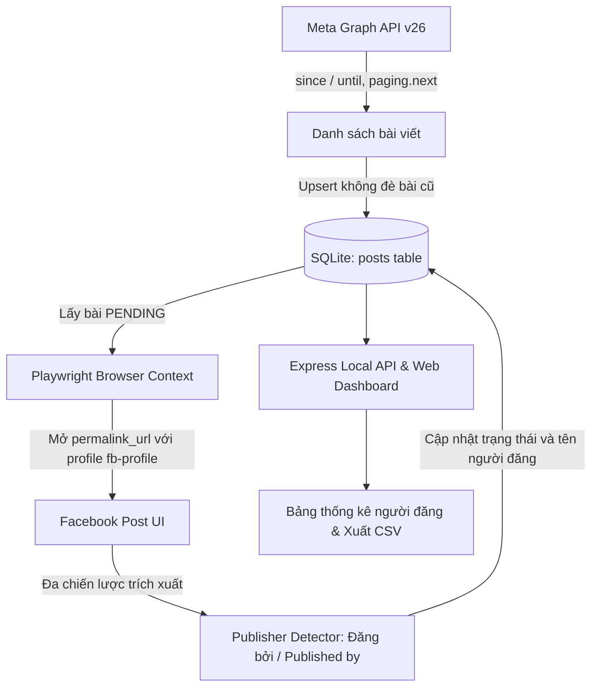

# 📊 THỐNG KÊ BÀI VIẾT FANPAGE & NGƯỜI ĐĂNG (FACEBOOK FANPAGE PUBLISHER STAT)

Công cụ local tự động đồng bộ danh sách bài viết Fanpage qua **Meta Graph API v26**, mở trực tiếp permalink bằng **Playwright** với phiên quản trị đã đăng nhập để trích xuất tên người đăng bài ("Đăng bởi / Published by..."), lưu trữ vào **SQLite** và cung cấp **Dashboard web trực quan**.

---

## 🏗️ 1. KIẾN TRÚC HỆ THỐNG



---

## 📋 2. BẢNG TỔNG QUAN TÍNH NĂNG

| Hạng mục | Chi tiết |
|---|---|
| **Graph API** | Meta Graph API `v26.0`, hỗ trợ `paging.next`, tự động lấy tương tác bài viết (Likes, Comments, Shares), chuyển đổi múi giờ `Asia/Ho_Chi_Minh` sang UTC |
| **Bảo mật** | Tuyệt đối không log Access Token, không lưu token vào DB, ẩn token trong log lỗi, loại trừ hoàn toàn `.env` và `fb-profile` khỏi Git |
| **Browser** | Playwright Chromium tái sử dụng `persistent context` (`./fb-profile`), phát hiện phiên hết hạn |
| **Detector** | Nhận diện đa chiến lược: ưu tiên thẻ con sâu nhất, lọc ký tự ẩn Unicode `\u034F`, hỗ trợ modal dialog và bài viết độc lập |
| **Database** | SQLite (`better-sqlite3`) lưu trữ tại `data/facebook-stat.sqlite`, chế độ WAL |
| **Giao diện** | Dashboard Express + HTML/CSS/JS thuần, chuẩn ngày `dd/mm/yyyy`, hiển thị lượt tương tác (Like, Comment, Share), polling tiến độ mỗi 1s, lọc người đăng, tìm kiếm |
| **Xuất dữ liệu**| Hỗ trợ xuất **Excel (.xlsx)** chuyên nghiệp có định dạng cột & **CSV (UTF-8 BOM)** xem ngay trên Excel không lỗi font |
| **Debug** | Tự động lưu `screenshot.png`, `page.html`, `visible-text.txt`, `meta.json` vào `debug/` khi không tìm thấy |

---

## ⚙️ 3. YÊU CẦU HỆ THỐNG & CÀI ĐẶT

### Yêu cầu:
- **Node.js**: Phiên bản 18.x trở lên (đã tích hợp `fetch` native).
- Hệ điều hành: Windows / macOS / Linux.

### Cài đặt:
```bash
# 1. Cài đặt các gói phụ thuộc
npm install

# 2. Cài đặt trình duyệt Chromium cho Playwright
npx playwright install chromium
```

---

## 🔐 4. CẤU HÌNH .ENV

Sao chép từ `.env.example` sang `.env` và điền thông tin:

```env
FB_PAGE_ID=123456789012345
FB_PAGE_ACCESS_TOKEN=EAAG...YOUR_PAGE_ACCESS_TOKEN_HERE

PORT=3000
FB_GRAPH_VERSION=v26.0
FB_PROFILE_DIR=./fb-profile
FB_HEADLESS=false
FB_CONCURRENCY=2
FB_DELAY_MIN_MS=1500
FB_DELAY_MAX_MS=3500
FB_MAX_RETRIES=2
TZ=Asia/Ho_Chi_Minh
```

> [!CAUTION]
> **Bảo mật:** Không bao giờ commit file `.env` hoặc chia sẻ `FB_PAGE_ACCESS_TOKEN`. File `.env` đã được cấu hình trong `.gitignore`.

---

## 🚀 5. HƯỚNG DẪN SỬ DỤNG THEO CÁC BƯỚC

### BƯỚC 1: Đăng nhập tài khoản Facebook quản trị
```bash
npm run login
```
- Trình duyệt Chromium sẽ mở ra trang `https://www.facebook.com/`.
- Hãy đăng nhập tài khoản Facebook có quyền quản trị Fanpage (hỗ trợ nhập mã xác thực 2 bước 2FA).
- > [!IMPORTANT]
  > **BƯỚC QUYẾT ĐỊNH:** Sau khi đăng nhập, hãy click vào **Avatar góc trên bên phải Facebook** và chọn **Chuyển sang trang (Switch profile to Fanpage)**. Facebook chỉ hiển thị nhãn `"Người đăng: [Tên người đăng]"` khi trình duyệt đang hoạt động dưới tư cách Fanpage, nếu ở tư cách trang cá nhân thì Facebook sẽ ẩn nhãn này!
- Sau khi đã chuyển sang Fanpage, hãy đóng cửa sổ Chromium. Session sẽ được lưu vĩnh viễn trong thư mục `./fb-profile`.

---

### BƯỚC 2: Kiểm tra thử nghiệm 1 bài viết (Single Post Test)
Trước khi quét hàng loạt, hãy test thử trên 1 link bài viết thật:
```bash
npm run test:post -- "https://www.facebook.com/namnhatrangdatvanguoi/posts/..."
```
Output mẫu khi thành công:
```text
[Test] URL: https://facebook.com/...
[Test] Đang mở Facebook...
[Test] Kết quả:
Status: FOUND
Publisher: Darnell Trương
Method: published-by-name-matched-anchor
Raw text: "Người đăng: Darnell Trương ❓ · 5 giờ · 🌐"
```
*Nếu trả về `NOT_FOUND`, hệ thống tự tạo snapshot đầy đủ trong thư mục `debug/{post_id}/`.*

---

### BƯỚC 3: Chạy Dashboard Web
```bash
npm run dev
# hoặc
npm start
```
Mở trình duyệt truy cập:
👉 **http://localhost:3000**

Giao diện cung cấp:
- Lựa chọn khoảng ngày chuẩn **`dd/mm/yyyy`** (Từ ngày - Đến ngày theo giờ Việt Nam).
- **Thống kê tương tác trực quan**: Lượt Thích (Likes), Bình luận (Comments), Chia sẻ (Shares) lấy tự động từ Graph API.
- **Nút "Đồng bộ bài viết"**: Gọi Graph API v26 lấy bài và lưu SQLite.
- **Nút "Lấy người đăng"**: Chạy worker Playwright trích xuất người đăng bài.
- **Nút "Đồng bộ tất cả"**: Tự động chạy cả 2 bước trên.
- **Bảng thống kê người đăng**: Click vào tên để lọc nhanh danh sách bài viết.
- **Thanh tiến độ (Progress)**: Cập nhật thời gian thực mỗi 1 giây.
- **Xuất Excel (.xlsx)**: File bảng tính định dạng đẹp, căn chỉnh độ rộng cột, đầy đủ thông số tương tác và người đăng.
- **Xuất CSV**: Tải file dữ liệu tiếng Việt UTF-8 BOM chuẩn để mở trực tiếp trong Excel.

---

### BƯỚC 4: Hoặc sử dụng qua dòng lệnh (CLI)
```bash
# 1. Đồng bộ bài viết từ Graph API trong khoảng ngày
npm run sync -- --since=2026-07-01 --until=2026-09-30

# 2. Chạy worker tìm người đăng
npm run publishers

# Quét lại toàn bộ bài viết kể cả bài đã xử lý:
npm run publishers -- --force

# 3. Xem thống kê tổng hợp dạng bảng
npm run stats
```

---

## 🗄️ 6. CẤU TRÚC DATABASE (SQLITE)

File cơ sở dữ liệu: `data/facebook-stat.sqlite`

Bảng `posts`:
| Cột | Kiểu | Mô tả |
|---|---|---|
| `id` | `TEXT PRIMARY KEY` | ID bài viết từ Facebook |
| `page_id` | `TEXT` | ID của Fanpage |
| `message` | `TEXT` | Nội dung văn bản bài viết |
| `created_time` | `TEXT` | Thời gian tạo bài (UTC) |
| `permalink_url` | `TEXT` | Đường dẫn trực tiếp bài viết |
| `likes_count` | `INTEGER` | Lượt thích / cảm xúc (từ Graph API) |
| `comments_count` | `INTEGER` | Lượt bình luận (từ Graph API) |
| `shares_count` | `INTEGER` | Lượt chia sẻ (từ Graph API) |
| `publisher_id` | `TEXT` | UID người đăng bài (nếu trích xuất được) |
| `publisher_name` | `TEXT` | Tên người quản trị đăng bài |
| `publisher_profile_url` | `TEXT` | Link trang cá nhân người đăng |
| `publisher_raw_text` | `TEXT` | Văn bản gốc phát hiện được |
| `publisher_status` | `TEXT` | `PENDING`, `FOUND`, `NOT_FOUND`, `LOGIN_REQUIRED`, `POST_UNAVAILABLE`, `ERROR` |
| `publisher_method` | `TEXT` | Phương thức trích xuất thành công |
| `publisher_checked_at` | `TEXT` | Thời điểm kiểm tra |
| `attempt_count` | `INTEGER` | Số lần đã thử quét |
| `last_error` | `TEXT` | Chi tiết lỗi (nếu có) |

---

## ❓ 7. VÌ SAO KHÔNG DÙNG ADMIN_CREATOR TRONG GRAPH API?

Trong thực tế kiểm nghiệm trên **Meta Graph API v26**:
- Dù ứng dụng có đầy đủ quyền `pages_show_list`, `pages_read_engagement`, `business_management`, `public_profile`.
- Đã dùng đúng **Page Access Token**.
- Fanpage có nhiều quản trị viên cùng đăng bài.
- Nhưng trường `admin_creator` **KHÔNG** được Facebook trả về (hoặc trả về `null`).

**Giải pháp tối ưu:**
Kết hợp Meta Graph API chính thức để lấy nhanh danh sách `id`, `message`, `created_time`, `permalink_url`, sau đó sử dụng Playwright mở trực tiếp `permalink_url` bằng tài khoản quản trị để đọc nhãn *"Đăng bởi / Published by"* có sẵn trên giao diện Facebook.

---

## 🛠️ 8. XỬ LÝ LỖI THƯỜNG GẶP

1. **`OAuthException 190: Error validating access token: Session has expired`**:
   - Page Access Token trong `.env` đã hết hạn. Hãy truy cập Meta for Developers / Graph API Explorer để lấy Page Access Token mới (khuyên dùng Long-lived Page Access Token thời hạn 60 ngày) và cập nhật vào `FB_PAGE_ACCESS_TOKEN` trong file `.env`.
   - *Lưu ý:* Các bài viết đã được lưu trong SQLite vẫn có thể chạy "Lấy người đăng" và "Xuất Excel" bình thường mà không bị ảnh hưởng.
2. **`Phiên Facebook đã hết hạn. Hãy chạy: npm run login`**:
   - Cookie hoặc phiên đăng nhập của Chromium đã hết hạn. Chạy `npm run login` để đăng nhập lại.
3. **Bài viết trả về `NOT_FOUND`**:
   - Kiểm tra xem trong Chromium (`npm run login`) đã **chuyển sang tư cách Fanpage** hay chưa. Nếu đang ở tư cách cá nhân, Facebook sẽ ẩn dòng "Người đăng".
   - Mở thư mục `debug/` tương ứng với ID bài viết để xem `screenshot.png` và `visible-text.txt`.
4. **Không bị chặn IP/Checkpoint Facebook**:
   - Hệ thống áp dụng cấu hình ngẫu nhiên `FB_DELAY_MIN_MS` (1500ms) - `FB_DELAY_MAX_MS` (3500ms) và giới hạn `FB_CONCURRENCY=2` để đảm bảo trình duyệt hoạt động ổn định và an toàn như người dùng thật.
